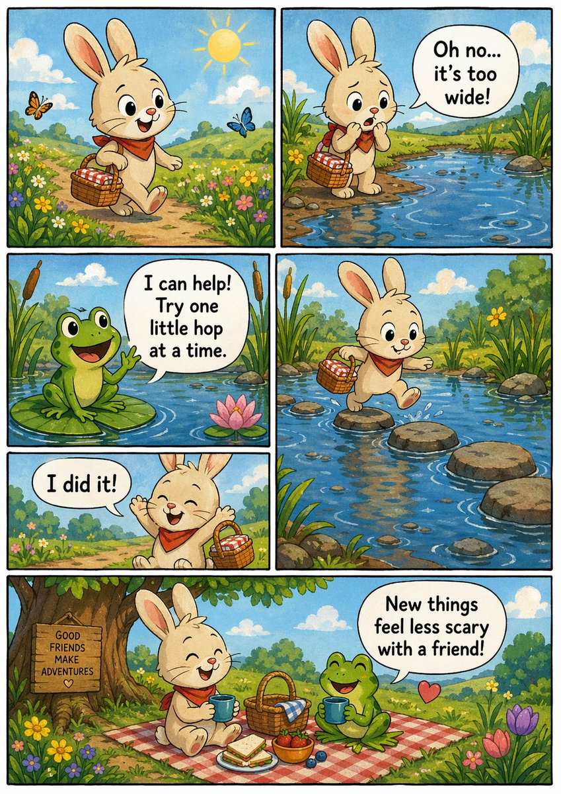
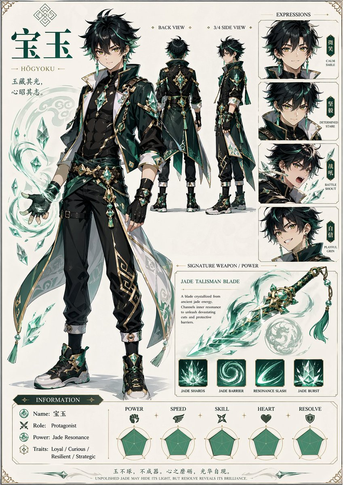
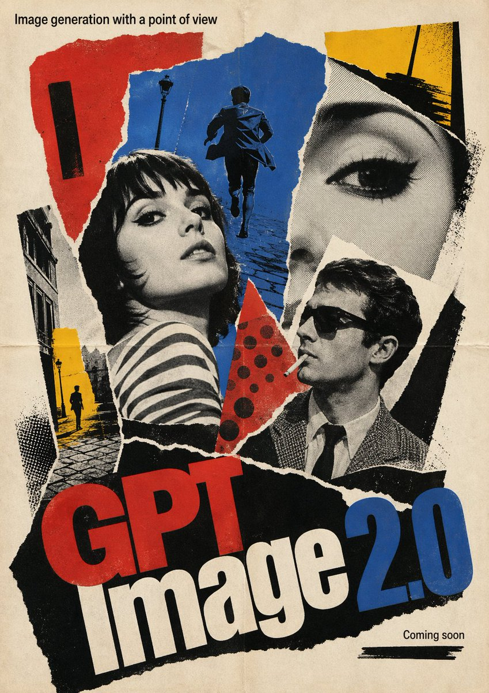
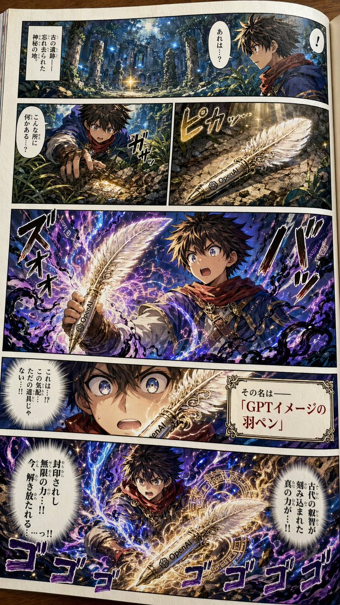
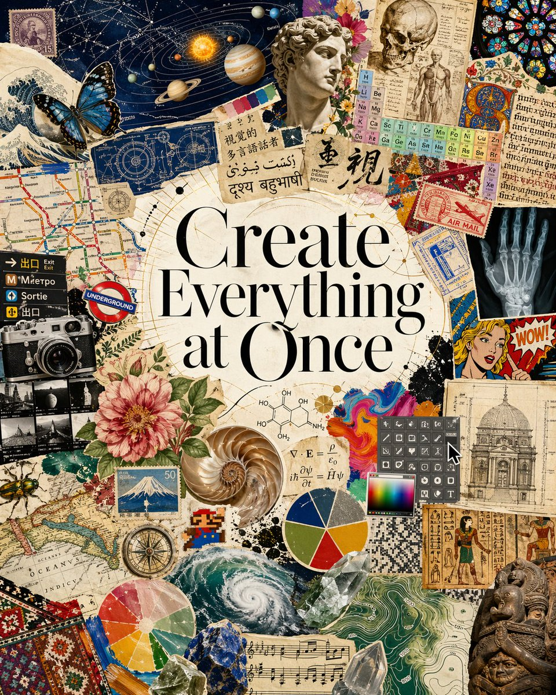

# @dotey (宝玉) - GPT Image 2 提示词

来源：https://x.com/dotey

## 预览图册

| 预览 | 日期 | 标题 | 类型 |
|------|------|------|------|
|  | 2026-04-23 | [Split Face Pop Art](./2026-04-23-split-face-pop-art.md) | 风格融合 |
|  | 2026-04-23 | [中式山水国风](./2026-04-23-chinese-landscape.md) | 国风插画 |
|  | 2026-04-23 | [水彩绘本插画](./2026-04-23-watercolor-book.md) | 儿童绘本 |
|  | 2026-04-23 | [草帽海贼团](./2026-04-23-one-piece-sunset.md) | 动漫 |
|  | 2026-04-23 | [吉卜力公主](./2026-04-23-ghibli-princess.md) | 吉卜力风格 |
|  | 2026-04-23 | [鹤与菊花](./2026-04-23-cranes-chrysanthemums.md) | 日式艺术 |
|  | 2026-04-23 | [咖啡狗](./2026-04-23-no-coffee-no-codee-dog.md) | 矢量插画 |
|  | 2026-04-23 | [咖啡熊猫](./2026-04-23-no-coffee-no-codee-panda.md) | 矢量插画 |
|  | 2026-04-22 | [成龙手办](./2026-04-22-jackie-chan-figure.md) | 写实风格 |
|  | 2026-04-22 | [海贼王漫画](./2026-04-22-comic-book-page.md) | 漫画 |
|  | 2026-04-22 | [动漫角色卡](./2026-04-22-anime-character-sheet.md) | 角色立绘 |
|  | 2026-04-22 | [法国新浪潮海报](./2026-04-22-movie-poster.md) | 电影海报 |
|  | 2026-04-22 | [少年漫画页](./2026-04-22-shonen-manga.md) | 少年漫画 |
|  | 2026-04-22 | [视觉多语言杂志](./2026-04-22-visual-polyglot.md) | 杂志拼贴 |
|  | 2026-04-19 | [广州城市宣传海报](./2026-04-19-guangzhou-poster.md) | 城市宣传 |
