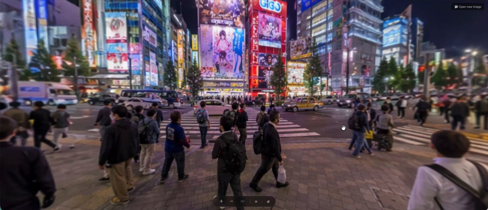
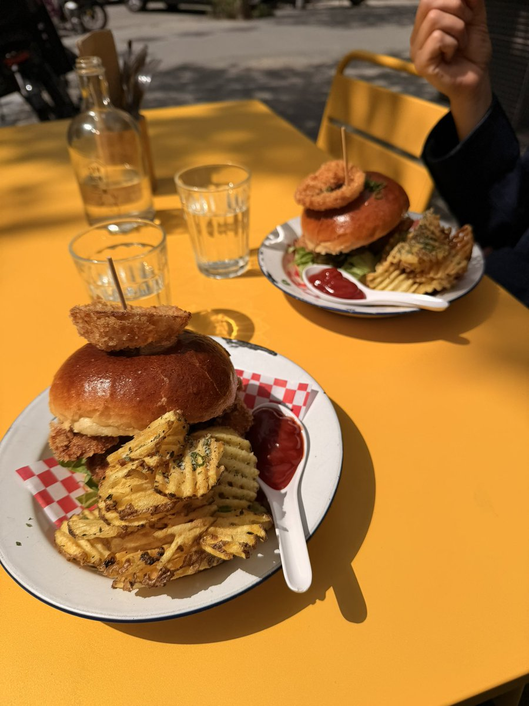
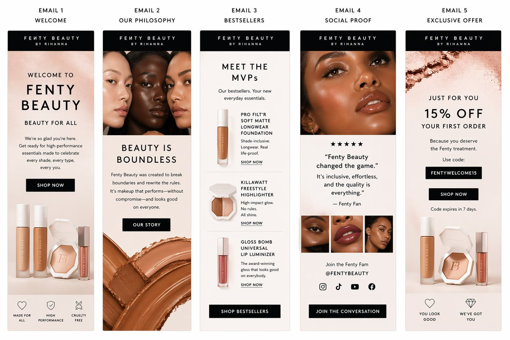
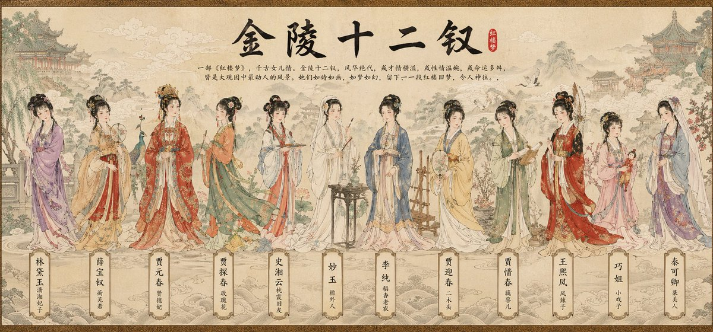
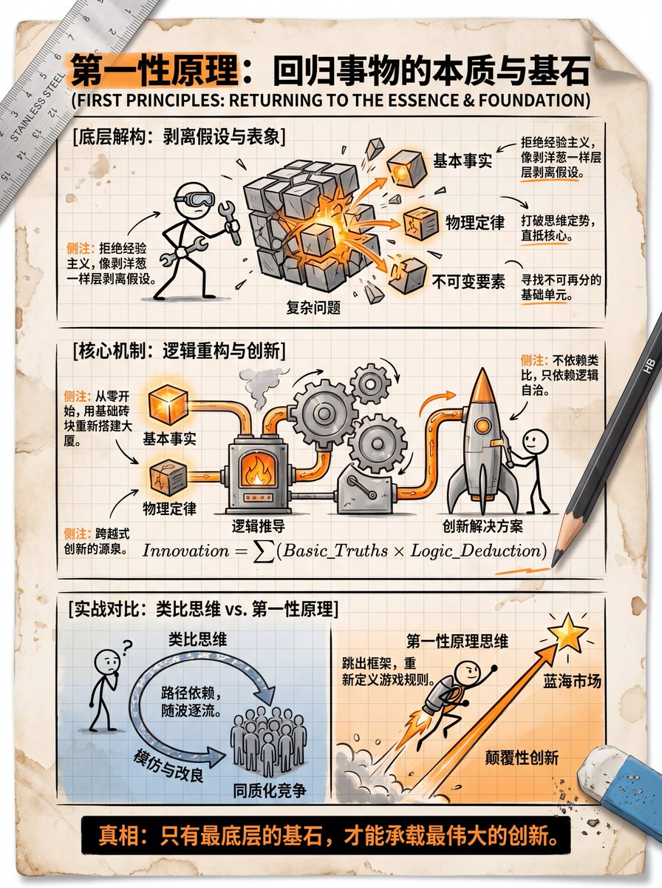

# 其他账号 - GPT Image 2 提示词

来源：X (Twitter) 各账号收集

## 预览图册

| 预览 | 标题 | 作者 | 类型 |
|------|------|------|------|
|  | [品牌套件](./brand-kit.md) | @venturetwins | 品牌设计 |
|  | [360 全景图](./panorama.md) | @venturetwins | 全景 |
|  | [餐厅品牌指南](./restaurant-brand.md) | @LinusEkenstam | 品牌设计 |
|  | [产品包装盒](./product-box.md) | @Salmaaboukarr | 产品设计 |
|  | [物体信息图](./infographics.md) | @TechieBySA | 信息图 |
|  | [美式漫画分镜](./comic-panels.md) | @0xbisc | 漫画 |
|  | [AI 实验室海报](./ai-poster.md) | @venturetwins | 海报 |
|  | [像素艺术网格](./pixel-art.md) | @ProperPrompter | 像素艺术 |
|  | [邮件营销图片](./email-marketing.md) | @Salmaaboukarr | 营销 |
|  | [GPT 漫画](./manga-gpt.md) | @venturetwins | 漫画 |
|  | [视觉信息设计风格集](./gpt-image-2-visual-styles.md) | @LudovicCreator 等 | 信息设计 |
|  | [水墨山水国风插画](./chinese-ink-landscape.md) | @dotey | 国风插画 |
|  | [可爱卡通插画](./kawaii-cartoon.md) | @dotey | 卡通插画 |
|  | [儿童绘本插画](./childrens-book-illustration.md) | @dotey | 绘本插画 |
|  | [杂志肖像编辑风](./editorial-portrait.md) | @BubbleBrain | 肖像摄影 |
|  | [复古胶片摄影风](./vintage-film-photography.md) | @BubbleBrain | 摄影风格 |
|  | [吉卜力风格插画](./ghibli-style.md) | @dotey | 动漫插画 |
|  | [产品广告摄影](./product-photography-ad.md) | @Salmaaboukarr | 产品摄影 |
|  | [日式鹤与菊图案](./japanese-crane-art.md) | @dotey | 传统艺术 |
|  | [情感分裂面部艺术](./emotional-split-face.md) | @dotey | 艺术创作 |
|  | [DK 百科博物馆风格](./geekcat-dk-encyclopedia.md) | @GeekCatX | 信息图 |
|  | [国风卷轴插画](./geekcat-chinese-scroll.md) | @GeekCatX | 国风插画 |
|  | [蒸汽朋克解剖图](./geekcat-steampunk-anatomy.md) | @GeekCatX | 复古科学 |
|  | [火柴人复古工程手稿](./geekcat-stick-figure.md) | @GeekCatX | 信息图 |
|  | [食物的一生信息图](./geekcat-food-infographic.md) | @GeekCatX | 美食科普 |
|  | [像素等距演进博物馆](./geekcat-isometric-pixel.md) | @GeekCatX | 像素艺术 |
|  | [复古黑白木刻电影票](./geekcat-woodcut-ticket.md) | @GeekCatX | 复古印刷 |

## 分类索引

### 国风/东方美学
- [水墨山水国风插画](./chinese-ink-landscape.md)
- [日式鹤与菊图案](./japanese-crane-art.md)
- [国风卷轴插画](./geekcat-chinese-scroll.md)

### 插画风格
- [可爱卡通插画](./kawaii-cartoon.md)
- [儿童绘本插画](./childrens-book-illustration.md)
- [吉卜力风格插画](./ghibli-style.md)
- [情感分裂面部艺术](./emotional-split-face.md)

### 品牌设计
- [品牌套件](./brand-kit.md)
- [餐厅品牌指南](./restaurant-brand.md)

### 信息图/可视化
- [物体信息图](./infographics.md)
- [视觉信息设计风格集](./gpt-image-2-visual-styles.md)
- [DK 百科博物馆风格](./geekcat-dk-encyclopedia.md)
- [火柴人复古工程手稿](./geekcat-stick-figure.md)
- [食物的一生信息图](./geekcat-food-infographic.md)

### 创意内容
- [AI 实验室海报](./ai-poster.md)
- [美式漫画分镜](./comic-panels.md)
- [GPT 漫画](./manga-gpt.md)
- [像素艺术网格](./pixel-art.md)
- [像素等距演进博物馆](./geekcat-isometric-pixel.md)

### 产品展示
- [产品包装盒](./product-box.md)
- [产品广告摄影](./product-photography-ad.md)

### 营销/运营
- [邮件营销图片](./email-marketing.md)

### 摄影风格
- [杂志肖像编辑风](./editorial-portrait.md)
- [复古胶片摄影风](./vintage-film-photography.md)

### 复古科学/印刷
- [蒸汽朋克解剖图](./geekcat-steampunk-anatomy.md)
- [复古黑白木刻电影票](./geekcat-woodcut-ticket.md)

### 环境/体验
- [360 全景图](./panorama.md)
